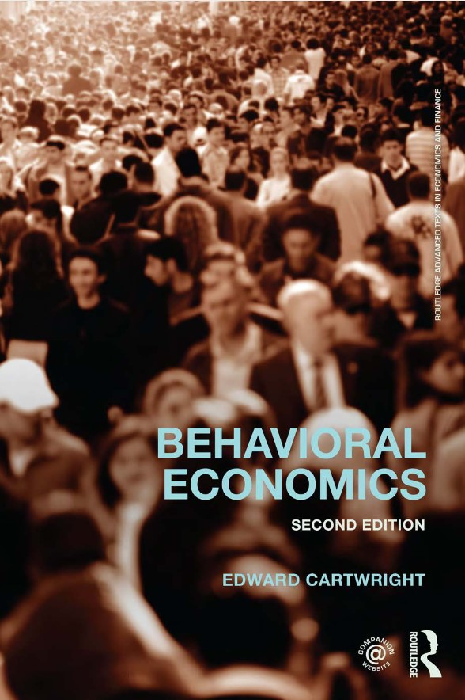
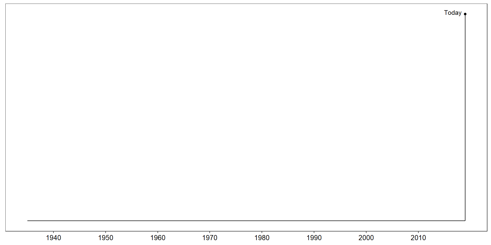
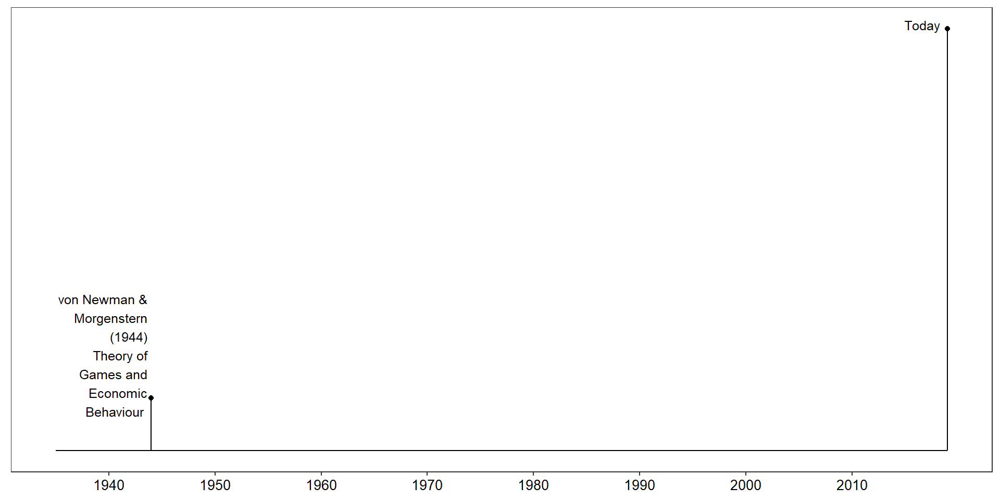
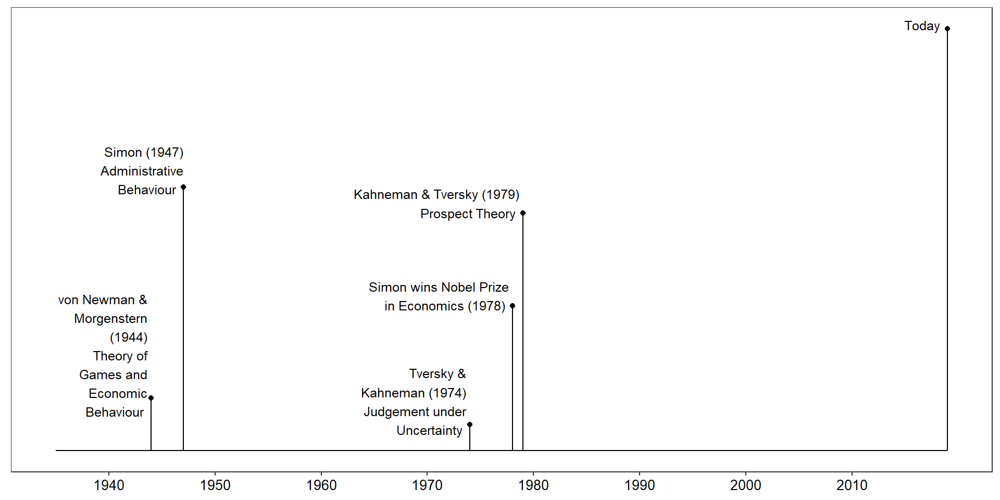
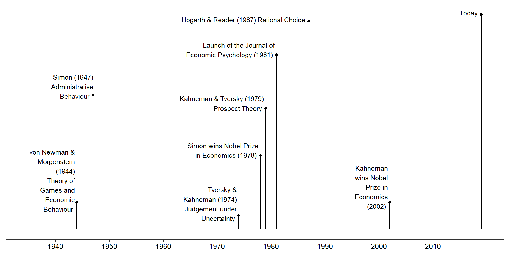

::: {.cell}

:::

## Economic Psychology is Everywhere

## Economic Psychology is Everywhere

<iframe width="900" height="600" src="https://www.youtube.com/embed/KbbZc2pab9k" title="The Wire - Stringer Bell changes the name of the product" frameborder="0" allow="accelerometer; autoplay; clipboard-write; encrypted-media; gyroscope; picture-in-picture; web-share" allowfullscreen></iframe>

## Economic Psychology is Everywhere

 

- In pairs/groups identify examples of Economic Psychology

## Before we begin

 

- Can you think of anything that influences people's decisions?

## Before we begin

 

## Before we begin

 

## Overview

- General Information and Housekeeping

- Topics to be covered

- Introduction to Economic Psychology

## General Information and Housekeeping {.smaller}

---------------------- ----------------------
Module Leader          Dr Cillian McHugh

Email                  [cillian.mchugh@ul.ie](mailto:cillian.mchugh@ul.ie)

Office                 KBG-22

Student Hours          Wednesdays, 11-12
                       ([book an appointment here](https://outlook.office.com/bookwithme/user/f570b7289a5343259c60c8a5d26ce510@ul.ie/meetingtype/a5wS5iMLaEGjeXKh-w2n1g2?anonymous&ep=mLinkFromTile))

Lecture location       P1003

Day and Time           Wednesdays, 9-11

---------------------- ----------------------

## Lectures

- 2 hour slot (Wednesday mornings)
- Interactive (discussion + activities)
- Will be recorded
- Do not come in if you are sick!!!

## Core Texts {.smaller}

:::: {.columns .incremental}

::: {.column width="60%"}

 
&nbsp;&nbsp;&nbsp;
@camerer_advances_2003
&nbsp;&nbsp;&nbsp;       

 
&nbsp;&nbsp;&nbsp;
@altman_Handbook_2017
&nbsp;&nbsp;&nbsp; 

:::

::: {.column width="40%"}

 
&nbsp;&nbsp;&nbsp;
@cartwright_behavioral_2014
&nbsp;&nbsp;&nbsp;      

 
&nbsp;&nbsp;&nbsp;
@ranyard_economic_2018

:::

::::

- Additional readings will be highlighted during lectures

## Assessment{.smaller}

  

------------------------------------------------------------------------------
Type of Assessment       % of Final Grade         Deadline
--------------------- --------------------- ----------------------------------
Task 1                  25\%                 Wednesday 18th October at 4pm 
  
Task 2                  30\%                 Wednesday 8th November at 4pm 
  
Exam                    45\%                 Exam Week (1 hour)

-------------------------------------------------------------------------------

# Topics to be covered

## Topics to be covered 

:::: {.columns .incremental}

::: {.column width="40%"}
Theories of Decision Making

Heuristics and Biases

Game Theory

Nudges and Other Contextual Influences

Future Decisions and Affective Forecasting

:::

::: {.column width="40%"}
Emotional Influences

Loss Aversion/Risk Aversion and Endowment Effects

Mental Accounting

Fairness and Ethics

Gambling
:::

::::

## Activity: ([link here](https://docs.google.com/document/d/1iBG-SDrUpJX1RtsfmynqL8WY9git7VfaZvMuuhAGJ0I/edit?usp=sharing))

:::: {.columns}

::: {.column width="40%" .incremental}
Theories of Decision Making

Heuristics and Biases

Game Theory

Nudges and Other Contextual Influences

Future Decisions and Affective Forecasting

:::

::: {.column width="40%"}
Emotional Influences

Loss Aversion/Risk Aversion and Endowment Effects

Mental Accounting

Fairness and Ethics

Gambling
:::

::::

# Introduction to Economic Psychology

## Defining Economic Psychology

 

- "The science of economic mental life and behaviour"  [@ranyard_economic_2018, p. 5]

- The study of "how individuals affect the economy and how the economy affects individuals"   [@lea_individual_1987, p. 2; see @ranyard_economic_2018, p. 5]
 
- Branch of *Applied Psychology* [@ranyard_economic_2018]
 
- **Interdisciplinary**
   + Psychology
   + Behavioural Economics

## Homo Economicus and the Standard Economic Model{.smaller}

- *Homo Economicus*:
  + a rational individual 
  + makes rational decisions
  + that maximize utility
  + is self-interested
  + capable of learning from experience
  + stable, consistent preferences  [@ranyard_economic_2018, p. 6; see also @lea_individual_1987; @warneryd_economics_2008; @cartwright_behavioral_2014]

## Behavioural Economics & Economic Psychology{.smaller}

- Adam Smith
  - *An Inquiry into the Causes of the Wealth of Nations* (1776)
  - *The Theory of Moral Sentiments* (1759)
    - invisible hand of the market

- Vilfredo Pareto (1897)
  - "Pure political economy has therefore a great interest in relying as little as possible on the domain of psychology"

[@cartwright_behavioral_2014]

## Behavioural Economics Reborn

- Herbert Simon 
  - "Bounded Rationality" (1955)
  - Questioned the logic of the Standard Economic Model
- Daniel Kahneman and Amos Tversky
  - Evidence against the Standard Economic Model
  
## Evidence Against Standard Economic Model

 

- A bat and ball cost €1.10 in total. The bat costs €1.00 more than the ball.
How much does the ball cost? _______ cents

## Evidence Against Standard Economic Model

 

- A bat and ball cost €1.10 in total. The bat costs €1.00 more than the ball.
How much does the ball cost? _______ cents

  + Correct answer:    5 cent

## Behavioural Economics Reborn (contd)

- Vernon Smith
  - Markets Work
- Reinhard Selten
  - multiple equilibria

## Early Emergence of Economic Psychology{.smaller}

 

- Adam Smith (1723 – 1790)

  + "we suffer more . . . when we fall from a better to a worse situation than we ever enjoy when we rise from a worse to a better"  [@smith_theory_1759, p. 311; see @camerer_advances_2003, p. 5]

- Jeremy Bentham (1748–1832)

  + Building on Smith’s concept of self-love developed the concept of utility and calculations to maximise utility  [@camerer_advances_2003; @ranyard_economic_2018]

- John Stuart Mill (1806–1873)

  + Conceived *homo economicus* [see @ranyard_economic_2018]
    + Preference for a larger gain over a smaller gain

## Emergence of Economic Psychology

 

::: {.cell}
::: {.cell-output-display}
{width=960}
:::
:::

- Timeline of recent emergence of Economic Psychology

## Emergence of Economic Psychology

 

::: {.cell}
::: {.cell-output-display}
{width=960}
:::
:::

- Early Publication

## Emergence of Economic Psychology

 

::: {.cell}
::: {.cell-output-display}
{width=960}
:::
:::

- Saticficing / Bounded rationality / *homo economicus* ?

## Emergence of Economic Psychology

 

::: {.cell}
::: {.cell-output-display}
{width=960}
:::
:::

> - Saticficing / Bounded rationality / *homo economicus* ?

## Emergence of Economic Psychology

 

::: {.cell}
::: {.cell-output-display}
{width=960}
:::
:::

- demonstrating difference from *homo economicus*

## Emergence of Economic Psychology

 

::: {.cell}
::: {.cell-output-display}
{width=90%}
:::
:::

- demonstrating difference from *homo economicus*

## Emergence of Economic Psychology

 

::: {.cell}
::: {.cell-output-display}
{width=90%}
:::
:::

- Launch of Journal of Economic Psychology

## Emergence of Economic Psychology

 

::: {.cell}
::: {.cell-output-display}
{width=960}
:::
:::

- Influential Publication

## Approaches to Studying Decision Making{.smaller}

- Normative Theories *versus* Behavioural Theories

- Normative (prescriptive) approaches
    + Influenced by economic and mathematical models of how decisions ***should*** be made
    + Assume people are rational
      + should make the optimal choice (the choice that best reflects the person’s preferences)
      + decisions should be consistent across settings

- Behavioural (descriptive) approaches
    + Describe how decisions are made

## Defining Rationality{.smaller}

  

- Epistemic rationality
  + Rational belief or inference
  + Has a conclusion that is true
  
- Rationality of action
  + Actions (as opposed to beliefs/inferences)
  + Helps to achieve a goal

- **Instrumental rationality**
  + "our mental states or processes are rational when they help us to achieve our goals"  [@over_rationality_2004, p. 3]

## Discuss

- Differences between Behavioural Economics and Economic Psychology
- What is Rationality

## References{.smaller}

\noindent
\vspace{-2em}
\setlength{\parindent}{-0.5in}
\setlength{\leftskip}{0.5in}
\setlength{\parskip}{7.5pt}

